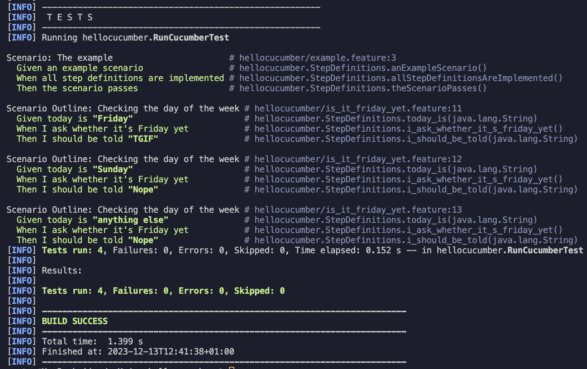
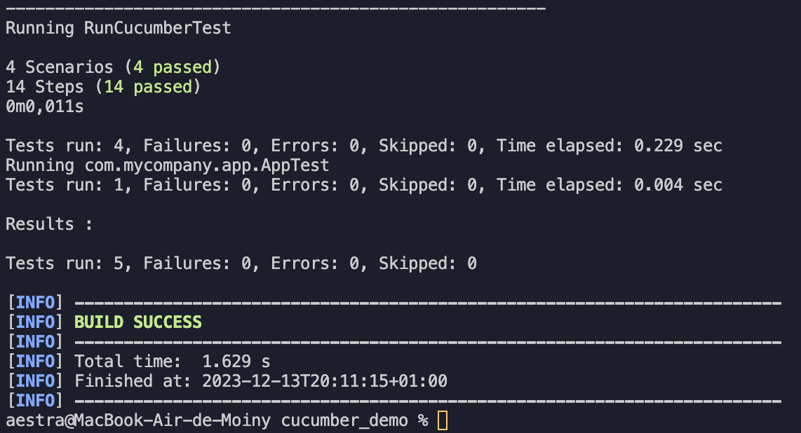

= R5.A.08 -- Dépôt pour les TPs
:icons: font
:MoSCoW: https://fr.wikipedia.org/wiki/M%C3%A9thode_MoSCoW[MoSCoW]

Ce dépôt concerne les rendus de mailto:yanis.moiny@etu.univ-tlse2.fr[Moiny Yanis].

== TP1

.Contenu de is_it_friday_yet.feature
```
Feature: Is it Friday yet?
  Everybody wants to know when it's Friday
  
    Scenario Outline: Checking the day of the week
    Given today is "<day>"
    When I ask whether it's Friday yet
    Then I should be told "<answer>"

    Examples:
    | day           | answer |
    | Friday        | TGIF   |
    | Sunday        | Nope   |
    | anything else | Nope   |
```

.Image des tests de la feature


== TP2

.Contenu de Order.java
```
import cucumber.api.junit.Cucumber;
import org.junit.runner.RunWith;

import java.util.ArrayList;
import java.util.List;

@RunWith(Cucumber.class)
public class RunCucumberTest {
}

class Order {
    private String owner;
    private String target;
    private List<String> cocktails;
    private String message;

    public Order() {
        this.cocktails = new ArrayList<>();
    }

    public void declareOwner(String owner) {
        this.owner = owner;
    }

    public void declareTarget(String target) {
        this.target = target;
    }

    public List<String> getCocktails() {
        return cocktails;
    }

    public void addCocktail(String cocktailName) {
        cocktails.add(cocktailName);
    }

    public void nbrCocktail(int numberOfCocktails) {
        this.cocktails.clear(); // Clear existing cocktails if you only want the number specified
        for (int i = 0; i < numberOfCocktails; i++) {
            addCocktail("cocktail " + (i + 1)); // Add a unique name to each cocktail
        }
    }

    public void addMessage(String message) {
        this.message = message;
    }

    public String getTicketMessage() {
        return "From " + owner + " to " + target + ": " + message;
    }
}
```

.Image des tests de la feature


== TP3

...


