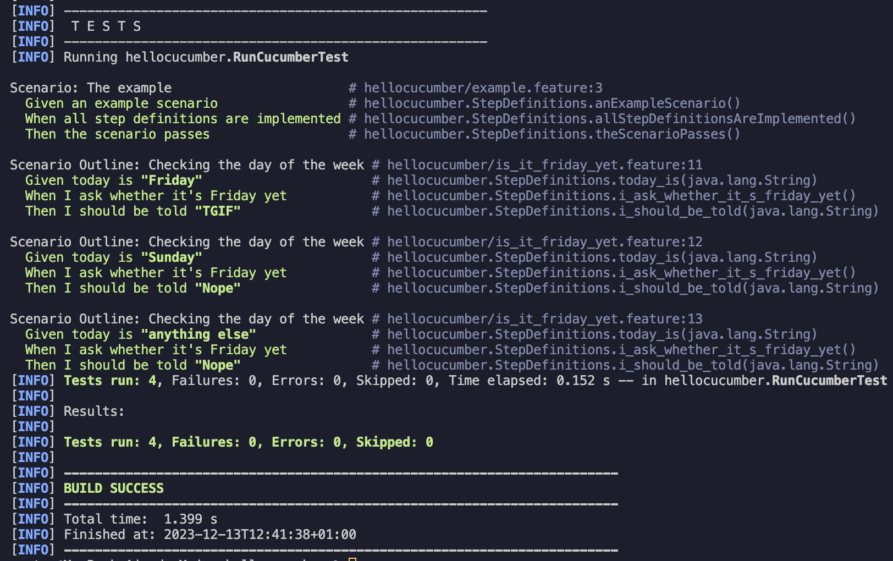

= R5.A.08 -- Dépôt pour les TPs
:icons: font
:MoSCoW: https://fr.wikipedia.org/wiki/M%C3%A9thode_MoSCoW[MoSCoW]

Ce dépôt concerne les rendus de mailto:yanis.moiny@etu.univ-tlse2.fr[Moiny Yanis].

== TP1

.Contenu de is_it_friday_yet.feature
```
Feature: Is it Friday yet?
  Everybody wants to know when it's Friday
  
    Scenario Outline: Checking the day of the week
    Given today is "<day>"
    When I ask whether it's Friday yet
    Then I should be told "<answer>"

    Examples:
    | day           | answer |
    | Friday        | TGIF   |
    | Sunday        | Nope   |
    | anything else | Nope   |
```

.Image des tests de la feature


== TP2...