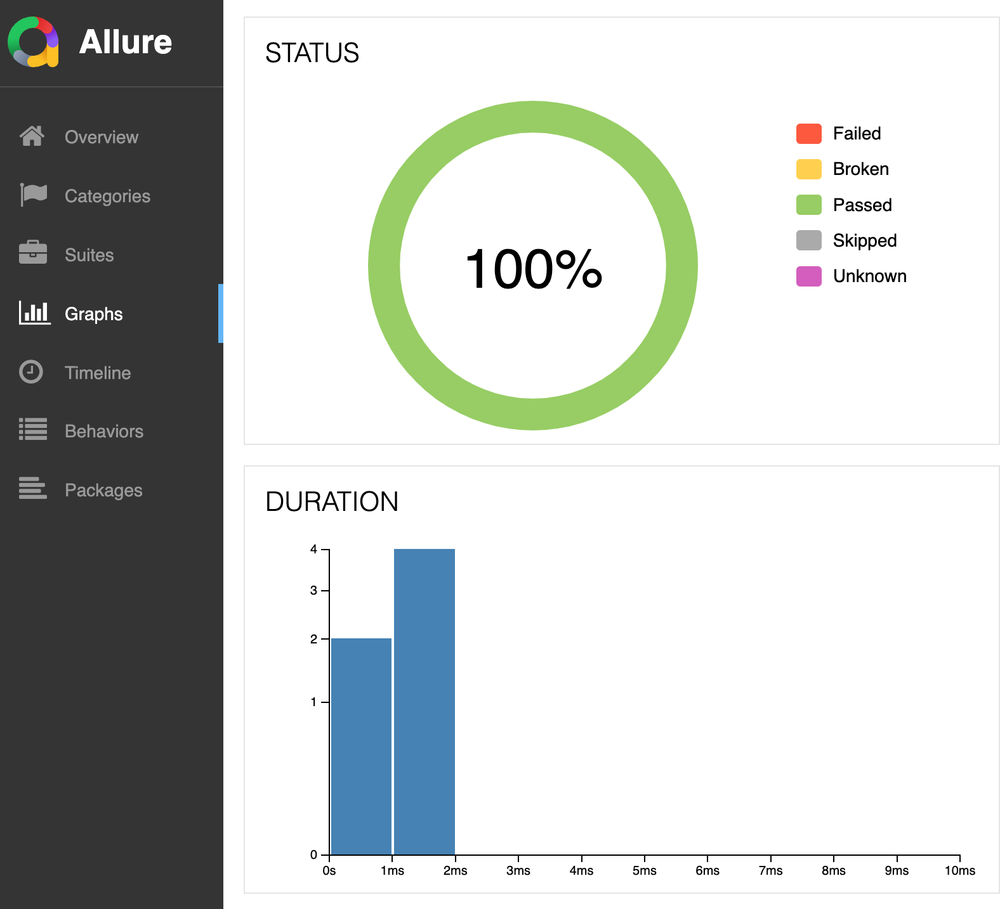
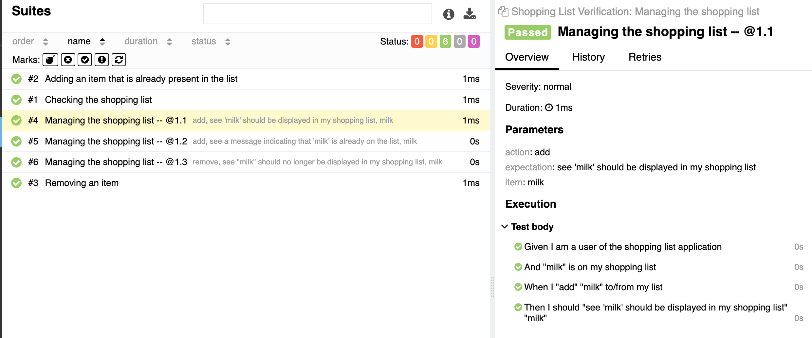
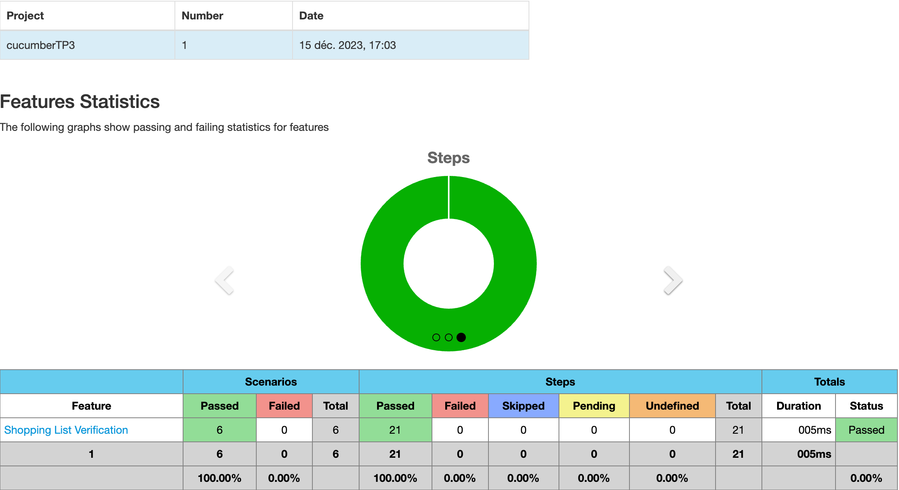
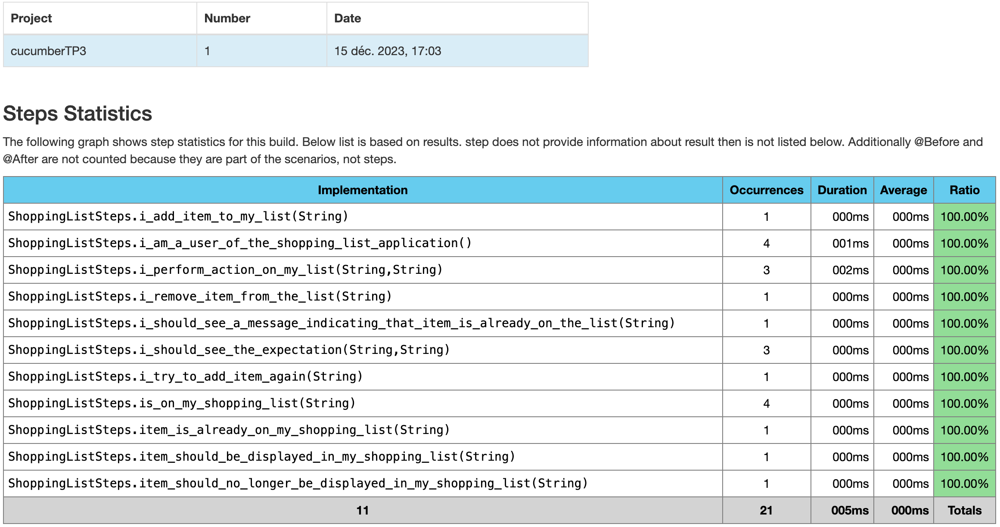

= R5.A.08 -- Dépôt pour les TPs
:toc: macro
:toclevels: 3
:toc-title: Table des matières
:MoSCoW: https://fr.wikipedia.org/wiki/M%C3%A9thode_MoSCoW[MoSCoW]

toc::[]

Ce dépôt concerne les rendus de mailto:yanis.moiny@etu.univ-tlse2.fr[Moiny Yanis].

== TP1

.Contenu de is_it_friday_yet.feature
[source,gherkin]
----
Feature: Is it Friday yet?
  Everybody wants to know when it's Friday
  
    Scenario Outline: Checking the day of the week
    Given today is "<day>"
    When I ask whether it's Friday yet
    Then I should be told "<answer>"

    Examples:
    | day           | answer |
    | Friday        | TGIF   |
    | Sunday        | Nope   |
    | anything else | Nope   |
----

.Image des tests de la feature
image::img/testTP1.png[Tests de la feature]

== TP2

.Contenu de Order.java
[source,java]
----
import cucumber.api.junit.Cucumber;
import org.junit.runner.RunWith;

import java.util.ArrayList;
import java.util.List;

@RunWith(Cucumber.class)
public class RunCucumberTest {
}

class Order {
    private String owner;
    private String target;
    private List<String> cocktails;
    private String message;

    public Order() {
        this.cocktails = new ArrayList<>();
    }

    public void declareOwner(String owner) {
        this.owner = owner;
    }

    public void declareTarget(String target) {
        this.target = target;
    }

    public List<String> getCocktails() {
        return cocktails;
    }

    public void addCocktail(String cocktailName) {
        cocktails.add(cocktailName);
    }

    public void nbrCocktail(int numberOfCocktails) {
        this.cocktails.clear(); // Clear existing cocktails if you only want the number specified
        for (int i = 0; i < numberOfCocktails; i++) {
            addCocktail("cocktail " + (i + 1)); // Add a unique name to each cocktail
        }
    }

    public void addMessage(String message) {
        this.message = message;
    }

    public String getTicketMessage() {
        return "From " + owner + " to " + target + ": " + message;
    }
}
----

.Image des tests de la feature
image::img/testTP2.png[Tests de la feature]

== TP3 (en Python)

TIP: Le but ici est de faire un test de la fonctionnalité de la liste de courses. C'est à dire que l'on va tester si l'ajout d'un élément dans la liste de courses fonctionne, si la suppression d'un élément fonctionne, si l'ajout d'un élément déjà présent dans la liste de courses fonctionne.

.Contenu de shopping_list.feature
[source,gherkin]
----
Feature: Shopping List Verification

  Scenario: Checking the shopping list
    Given I am a user of the shopping list application
    When I add 'milk' to my list
    Then 'milk' should be displayed in my shopping list

  Scenario: Adding an item that is already present in the list
    Given 'milk' is already on my shopping list
    When I try to add 'milk' again
    Then I should see a message indicating that 'milk' is already on the list

  Scenario: Removing an item
    Given 'milk' is on my shopping list
    When I remove 'milk' from the list
    Then 'milk' should no longer be displayed in my shopping list

  Scenario Outline: Managing the shopping list
    Given I am a user of the shopping list application
    And "<item>" is on my shopping list
    When I "<action>" "<item>" to/from my list
    Then I should "<expectation>" "<item>"

    Examples:
      | item  | action   | expectation                                                  |
      | milk  | add      | see 'milk' should be displayed in my shopping list           |
      | milk  | add      | see a message indicating that 'milk' is already on the list  |
      | milk  | remove   | see 'milk' should no longer be displayed in my shopping list |
----

.Contenu de shopping_list_steps.py
[source,python]
----
from behave import given, when, then, step
from assertpy import assert_that

shopping_list = set()
message = ""

@given('I am a user of the shopping list application')
def step_impl(context):
    pass

@given('"{item}" is on my shopping list')
def step_impl(context, item):
    shopping_list.add(item)

@given('"{item}" is already on my shopping list')
def step_impl(context, item):
    shopping_list.add(item)

@when('I try to add "{item}" again')
def step_impl(context, item):
    global message
    if item in shopping_list:
        message = f"{item} is already on the list"
    else:
        shopping_list.add(item)

@when('I add "{item}" to my list')
def step_impl(context, item):
    global message
    if item in shopping_list:
        message = f"{item} is already on the list"
    else:
        shopping_list.add(item)

@then('"{item}" should be displayed in my shopping list')
def step_impl(context, item):
    assert_that(shopping_list).contains(item)

@when('I remove "{item}" from the list')
def step_impl(context, item):
    shopping_list.discard(item)  # discard won't raise an error if the item is not present

@then('I should see a message indicating that "{item}" is already on the list')
def step_impl(context, item):
    assert_that(message).is_equal_to(f"{item} is already on the list")

@then('"{item}" should no longer be displayed in my shopping list')
def step_impl(context, item):
    assert_that(shopping_list).does_not_contain(item)

@when('I "{action}" "{item}" to/from my list')
def action_on_my_list(context, action, item):
    global message
    if action == "add":
        if item in shopping_list:
            message = f"{item} is already on the list"
        else:
            shopping_list.add(item)
    elif action == "remove":
        shopping_list.discard(item)

@then('I should "{expectation}" "{item}"')
def step_impl(context, expectation, item):
    if expectation == "see 'milk' should be displayed in my shopping list":
        assert_that(shopping_list).contains(item)
    elif expectation == "see a message indicating that 'milk' is already on the list":
        assert_that(message).is_equal_to(f"{item} is already on the list")
    elif expectation == "see 'milk' should no longer be displayed in my shopping list":
        assert_that(shopping_list).does_not_contain(item)
----

.Image montrant le pourcentage et le temps d'exécution de tests réussis

.Image montrant en détail des étapes des tests

=== TP3 bis (Reports en JAVA)

TIP: Le but ici est de faire le même test que précédemment mais en JAVA afin de découvrir comment générer des rapports de tests en JAVA.

.Contenu de shopping_list.feature
[source,gherkin]
----
Feature: Shopping List Verification

  Scenario: Checking the shopping list
    Given I am a user of the shopping list application
    When I add 'milk' to my list
    Then 'milk' should be displayed in my shopping list

  Scenario: Adding an item that is already present in the list
    Given 'milk' is already on my shopping list
    When I try to add 'milk' again
    Then I should see a message indicating that 'milk' is already on the list

  Scenario: Removing an item
    Given 'milk' is on my shopping list
    When I remove 'milk' from the list
    Then 'milk' should no longer be displayed in my shopping list

  Scenario Outline: Managing the shopping list
    Given I am a user of the shopping list application
    And "<item>" is on my shopping list
    When I "<action>" "<item>" to/from my list
    Then I should "<expectation>" "<item>"

    Examples:
      | item  | action   | expectation                                                  |
      | milk  | add      | see 'milk' should be displayed in my shopping list           |
      | milk  | add      | see a message indicating that 'milk' is already on the list  |
      | milk  | remove   | see 'milk' should no longer be displayed in my shopping list |
----

.Contenu de ShoppingListSteps.java
[source,java]
----
package stepdefs;

import static org.junit.Assert.*;

import java.util.*;

import cucumber.api.java.en.Given;
import cucumber.api.java.en.Then;
import cucumber.api.java.en.When;

public class ShoppingListSteps {

    private Set<String> shoppingList = new HashSet<>();
    private String message = "";

    @Given("^I am a user of the shopping list application$")
    public void i_am_a_user_of_the_shopping_list_application() {
    }

    @When("^I add '(.+)' to my list$")
    public void i_add_item_to_my_list(String item) {
        if (!shoppingList.add(item)) {
            message = item + " is already on the list";
        }
    }

    @Then("^'(.+)' should be displayed in my shopping list$")
    public void item_should_be_displayed_in_my_shopping_list(String item) {
        assertTrue(shoppingList.contains(item));
    }

    @Given("{string} is on my shopping list")
    public void is_on_my_shopping_list(String item) {
        shoppingList.add(item);
    }

    @Given("^'(.+)' is already on my shopping list$")
    public void item_is_already_on_my_shopping_list(String item) {
        shoppingList.add(item);
    }

    @When("^I try to add '(.+)' again$")
    public void i_try_to_add_item_again(String item) {
        i_add_item_to_my_list(item);
    }

    @Then("^I should see a message indicating that '(.+)' is already on the list$")
    public void i_should_see_a_message_indicating_that_item_is_already_on_the_list(String item) {
        assertEquals(item + " is already on the list", message);
    }

    @When("^I remove '(.+)' from the list$")
    public void i_remove_item_from_the_list(String item) {
        shoppingList.remove(item);
    }

    @Then("^'(.+)' should no longer be displayed in my shopping list$")
    public void item_should_no_longer_be_displayed_in_my_shopping_list(String item) {
        assertFalse(shoppingList.contains(item));
    }

    @When("I {string} {string} to\\/from my list")
    public void i_perform_action_on_my_list(String action, String item) {
        if ("add".equals(action)) {
            if (!shoppingList.add(item)) {
                message = item + " is already on the list";
            }
        } else if ("remove".equals(action)) {
            shoppingList.remove(item);
        }
    }

    @Then("I should {string} {string}")
    public void i_should_see_the_expectation(String expectation, String item) {
        switch (expectation) {
            case "see 'milk' should be displayed in my shopping list":
                assertTrue(shoppingList.contains(item));
                break;
            case "see a message indicating that 'milk' is already on the list":
                assertEquals(item + " is already on the list", message);
                break;
            case "see 'milk' should no longer be displayed in my shopping list":
                assertFalse(shoppingList.contains(item));
                break;
            default:
                fail("Unexpected expectation: " + expectation);
        }
    }
}
----

.Image montrant le pourcentage de tests réussis

.Image montrant en détail les statistiques des étapes des tests

